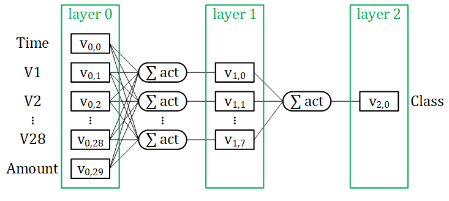
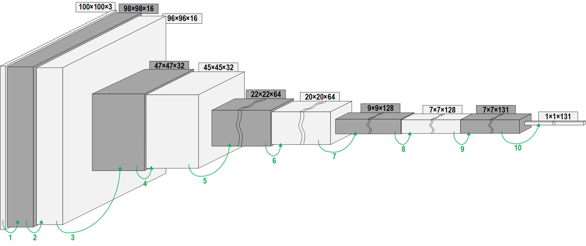
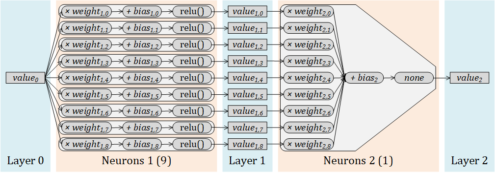
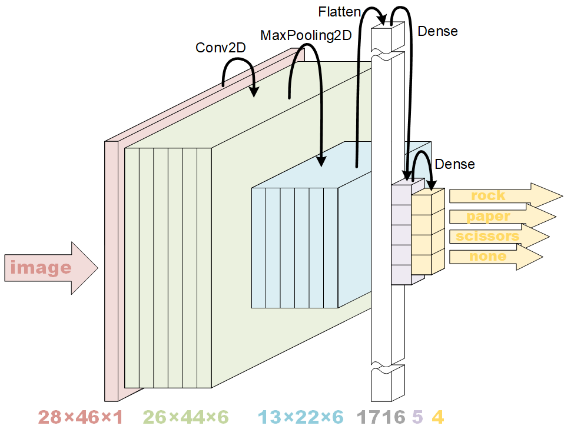

# MachineLearning
My first experiments with Machine Learning (TensorFlow in Jupyter notebook).

## Projects

- My [first project](creditcard/ML1CreditCard.ipynb) uses a _Jupyter notebook_ and a list of a quarter of a million credit card transaction 
  to make a neural network that detects the fraudulent ones.

  > 

- My [second project](fruitfind/fruitfind.ipynb) classifies 131 species of fruit (and vegetables and nuts).
  So here the I use a _convolutional_ neural network that takes images as input.

  > 

- My [third project](sine/sine.ipynb) tries to predict the `sin(x)` from `x`, a network even simpler than for the credit card transactions. 
  However, the real goal is to run the model on the ESP32, a goal that is [reached](sine/sine32). The same sketch even runs on ESP8266, albeit slower.
  There are two intermezzos. The [first](sine/piecewise-linear.ipynb) maps a piece-wise linear curve to a two-layer neural net.
  The [second](sine/piecewise-sine.ipynb) uses that technique to hand-craft a sine predictor.
  
  > 

- The [fourth project](rock-paper-scissors/rock-paper-scissors.ipynb) is no longer to educate me.
  This implements rock-paper-scissors on an ESP32 with a camera connected. 
  A supporting project ([ESP32CAM](https://github.com/maarten-pennings/esp32cam/tree/main/rock-paper-scissors)) 
  captured the images that were use for training the neural network.
  A follow-up project ([TFLcam](https://github.com/maarten-pennings/TFLcam)) is the resulting end-product.
  It can be used as a sensor in a rock-paper-scissors [Lego Mindstorms robot](https://www.youtube.com/watch?v=sf4MbvWIKFw).

  > 
  
(end of doc)
